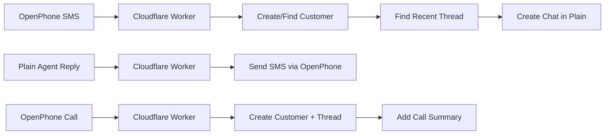

# Plain-OpenPhone Bridge

A Cloudflare Worker that enables seamless integration between Plain (customer support platform) and OpenPhone (business phone system), allowing support teams to handle SMS conversations and call management directly within Plain.

## TODOs

- Add a `Call Customer` button to Plain threads.
- Verify transcription handling from OpenPhone Calls within Plain
- MMS support (Currently not supported via the OpenPhone API, but supported in the OpenPhone UI, uploads images to openphone s3 bucket, before sending, etc.) maybe reverse engineer or switch to twilio
- vCard texting for new customers to save contact info of maple. Needs MMS support.
- Google Verified SMS

## 🎯 Overview

This bridge automatically synchronizes communications between Plain and OpenPhone, enabling:

- **Unified Support Experience**: Handle SMS and call interactions within Plain's interface
- **Automatic Thread Management**: Smart thread reuse within 12-hour windows to maintain conversation context
- **Bidirectional Sync**: Messages flow seamlessly between Plain and OpenPhone
- **Customer Recognition**: Automatic customer creation and matching via phone numbers

## ✨ Features

### Call Management
- Creates Plain threads automatically when OpenPhone calls complete
- Includes call duration, direction, and status information
- Optional call transcript integration

### SMS Integration
- **Inbound SMS**: OpenPhone messages appear as customer chats in Plain
- **Outbound SMS**: Plain agent messages are sent via OpenPhone SMS
- **Media Support**: Image URLs are included in Plain messages (images display as URLs)
- **Echo Prevention**: Prevents message loops between systems

### Smart Threading
- Reuses existing threads within 12-hour windows for continuous conversations
- Creates new threads for new conversations or after inactivity periods
- Maintains conversation context across multiple interactions

### Customer Management
- Automatically creates Plain customers using phone numbers as external IDs
- Generates placeholder emails in format: `{phone}@phone.maple.inc`
- Updates existing customer records on subsequent interactions

## 🔧 Supported Webhooks

### OpenPhone → Plain
- **`call.completed`**: Creates customer and thread with call summary
- **`call.transcript.completed`**: Adds call transcript to thread (logged only)
- **`message.received`**: Creates/updates customer and adds SMS to thread

### Plain → OpenPhone
- **`thread.chat_sent`**: Sends agent messages as SMS via OpenPhone

## 🚀 Quick Start

### Prerequisites

- Active OpenPhone subscription with admin access
- Plain workspace with API access
- Cloudflare Workers account
- Node.js 18+ and npm

### Installation

1. **Clone and install dependencies**:
   ```bash
   git clone <repository-url>
   cd plain-bridge
   npm install
   ```

2. **Configure environment variables**:
   ```bash
   # Set your API keys as Cloudflare secrets
   wrangler secret put PLAIN_API_KEY
   wrangler secret put OPENPHONE_API_KEY
   ```

3. **Deploy to Cloudflare Workers**:
   ```bash
   npm run deploy
   ```

### Webhook Configuration

After deployment, configure these webhook endpoints:

#### OpenPhone Webhooks
In your OpenPhone admin panel, add webhook URL:
```
https://plain-bridge.your-subdomain.workers.dev/webhooks/openphone
```

Enable these event types:
- `call.completed`
- `call.transcript.completed` (optional)
- `message.received`

#### Plain Webhooks
In your Plain workspace settings, add webhook URL:
```
https://plain-bridge.your-subdomain.workers.dev/webhooks/plain
```

Enable event type:
- `thread.chat_sent`

## 🔑 API Configuration

### Plain API Key Permissions
Your Plain API key requires these permissions:
- `customer:read` - Read customer information
- `customer:create` - Create new customers automatically
- `customer:update` - Update existing customer records
- `thread:create` - Create new support threads
- `thread:read` - Access thread information for reuse logic
- `chat:create` - Send customer messages to threads

### OpenPhone API Key
Generate an API key with admin privileges that includes:
- **Read access**: calls, messages, transcripts
- **Write access**: send messages

**Important**: OpenPhone API authentication uses the API key directly in the Authorization header (not Bearer token format):
```
Authorization: YOUR_API_KEY
```

## 🛠 Development

### Local Development
```bash
# Run in development mode with hot reload
npm run dev

# Test with curl (after setting up local environment)
curl -X POST http://localhost:8787/webhooks/openphone \
  -H "Content-Type: application/json" \
  -d '{"type":"message.received","data":{"object":{"from":"+1234567890","body":"Test message"}}}'
```

### Environment Variables
For local development, create a `.dev.vars` file:
```bash
PLAIN_API_KEY=your_plain_api_key
OPENPHONE_API_KEY=your_openphone_api_key
WEBHOOK_SECRET=optional_webhook_secret
```

### Deployment Environments
```bash
# Deploy to staging
npm run deploy -- --env staging

# Deploy to production
npm run deploy -- --env production
```

## 📋 How It Works

### Message Flow



### Key Behaviors

1. **Customer Identification**: Phone numbers serve as unique customer identifiers
2. **Thread Reuse**: Existing threads are reused within 12-hour windows to maintain conversation context
3. **Echo Prevention**: Machine user messages are filtered to prevent loops
4. **Media Handling**: Image URLs are embedded in text messages for Plain display
5. **Error Handling**: Comprehensive logging and error responses for debugging

### Data Mapping

| OpenPhone | Plain |
|-----------|-------|
| Phone number | Customer `externalId` |
| SMS conversation | Thread with chat messages |
| Call record | Thread with call summary |
| Media attachments | URLs in message text |

## 🔧 Configuration

### OpenPhone Setup
1. Generate API key in OpenPhone admin settings
2. Configure webhook URL pointing to your worker
3. Ensure your support phone number (+16464441357) is configured

### Plain Setup
1. Create API key with required permissions
2. Configure webhook for `thread.chat_sent` events
3. Ensure machine users can send chats

## 📊 Monitoring

### Cloudflare Workers Logs
Monitor webhook processing and errors:
```bash
# Tail production logs
wrangler tail --env production

# Tail with filtering
wrangler tail --env production --format pretty
```

### Common Issues

| Error | Cause | Solution |
|-------|-------|----------|
| 401 Unauthorized | Invalid API keys | Verify keys in Cloudflare secrets |
| 400 Bad Request | Malformed webhook payload | Check webhook configuration |
| GraphQL errors | Plain API schema changes | Update GraphQL queries |
| Echo loops | Machine user filter failing | Check `createdBy.actorType` logic |
| Missing threads | Thread reuse logic issues | Verify 12-hour window calculation |

## 🏗 Technical Details

### Built With
- **Runtime**: Cloudflare Workers
- **Framework**: Hono (lightweight web framework)
- **APIs**: Plain GraphQL API, OpenPhone REST API
- **Language**: TypeScript

### File Structure
```
src/
├── index.ts          # Main worker with all webhook handlers
├── types/            # TypeScript interfaces
wrangler.toml         # Cloudflare Workers configuration
package.json          # Dependencies and scripts
```

### Thread Reuse Logic
Threads are reused when:
- Customer has existing threads
- Most recent thread was updated within 12 hours
- Customer phone number matches exactly

### Security Considerations
- API keys stored as Cloudflare Worker secrets
- Webhook payload validation
- No sensitive data logged
- Phone numbers used as customer identifiers (consider privacy implications)

## 🤝 Contributing

1. Fork the repository
2. Create a feature branch: `git checkout -b feature-name`
3. Make changes and test locally
4. Commit with descriptive message
5. Push and create a pull request

## 📄 License

MIT License - see LICENSE file for details
